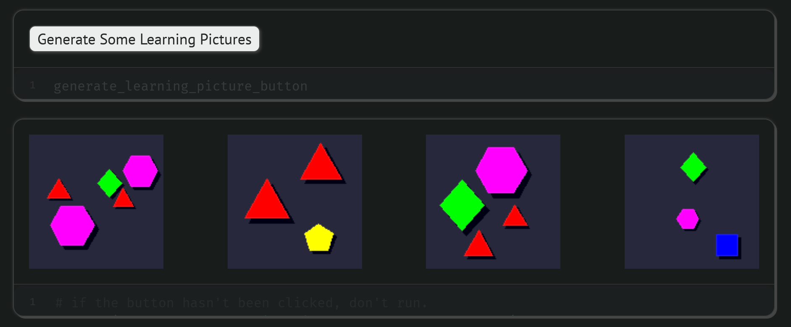
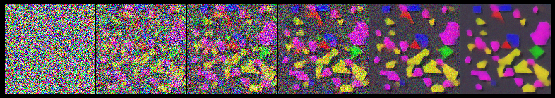

# Image generation using a Diffusion Model

⚠️ This part is still actively developped

## Training on on the fly generated pictures
Pictures contains triangles, squares, hexagons

## Learning to denoise using a ResUnet

## Denoising using DDPM

## Denoising using DDIM
🚧 Still not working... 🚧
