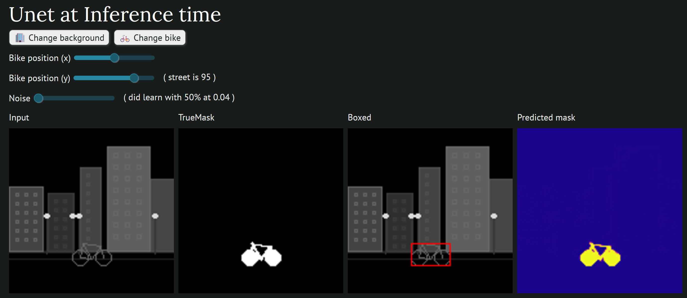

# What it looks like:


# A Unet that recognise a simplified byke in a 128x128 image
After promting Gemini 2.5 pro about Unet, it did provide the content of gemini_unet_urban_bike.ipynb

Basically it draw pictures of a stilized bike with a urban background.
And make the model learn the mask of the bike.

These pictures are drawn on the fly by pithon, so no need of a picture dataset.

I did separate the initian jupiter notebook in:
 - Training: unet_urban_bike_training.ipynb
 - Inference: marimo_inference.py

and the common code in:
- drawing_bike.py
- unet_model.py (Here is the Unet internal structure)

# How to run
Play unet_urban_bike_training.ipynb cells
and wait for some epoch to be finish.

After each epoch the model will then be written in ../../unet/bike_model.pth
No need to wait for the training. You can play the last cell of of the notebook to see it's progress. For the demo, 5 epoch are already good enough.

You could then use the marino interactive interface with
```cmd
marimo edit marimo_inference.py
```

